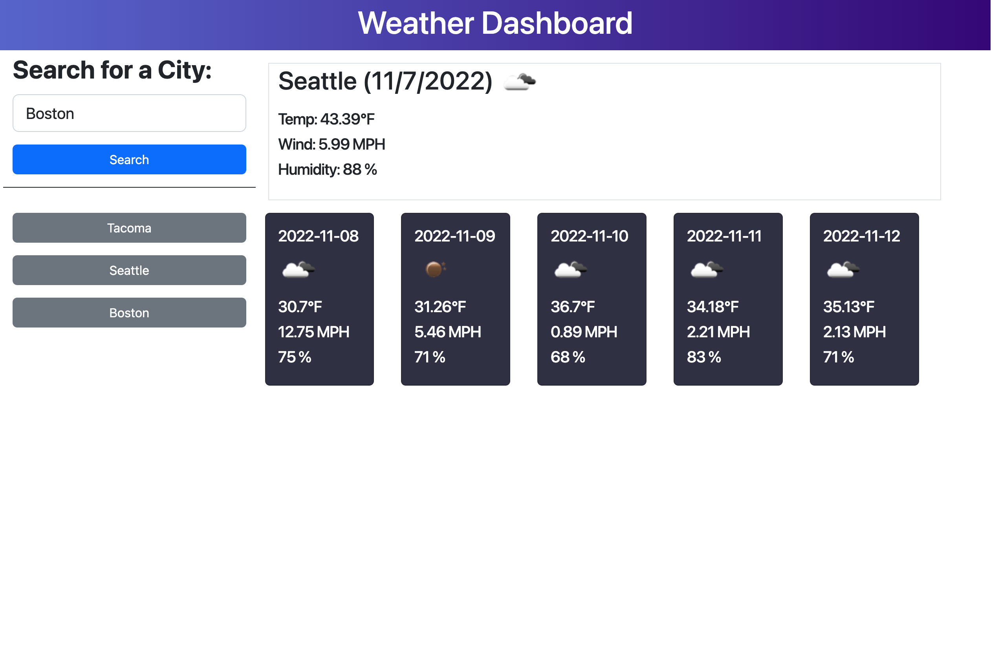

# Weather-Dashboard

## Description

This is a weather application that finds the current weather and five-day forecast for the city inputted by the user. The application provides the dates, weather icons, temperatures, wind speeds, and humidity for each city. The application saves recent searches that can be accessed by clicking the button with the city's name on it.

## Screenshot

## Link to application

This site was built using [GitHub Pages](https://ryan-m-taylor.github.io/Weather-Dashboard/)